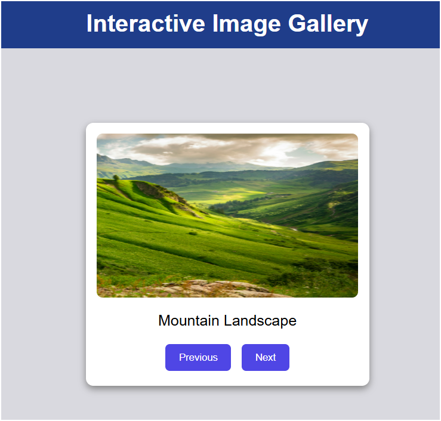
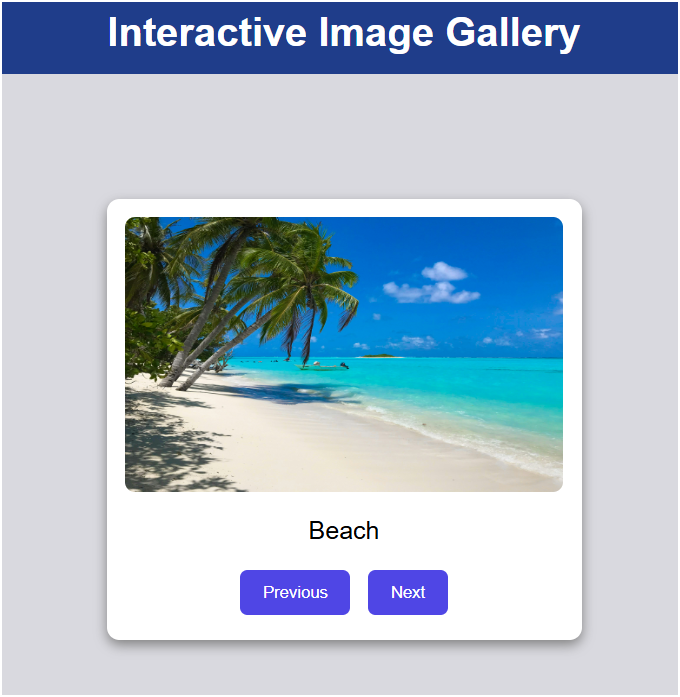
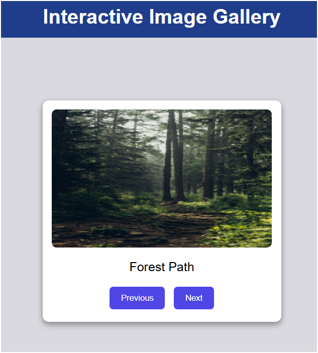
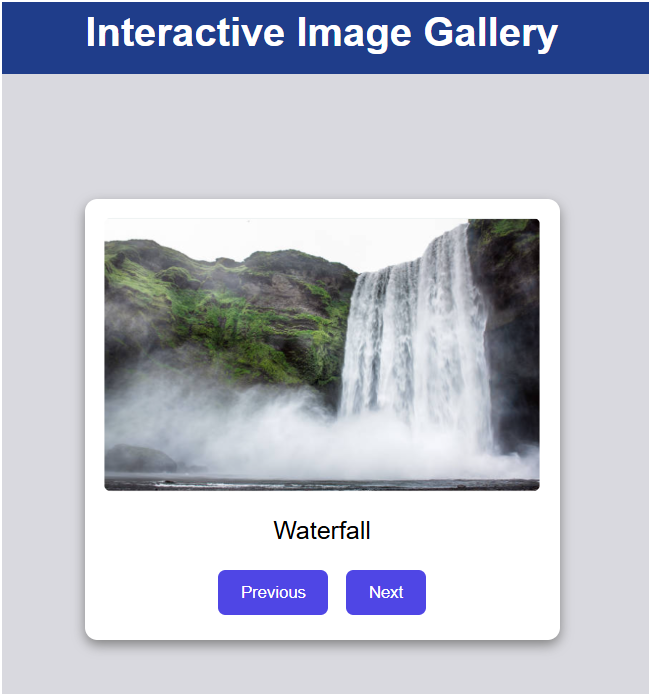
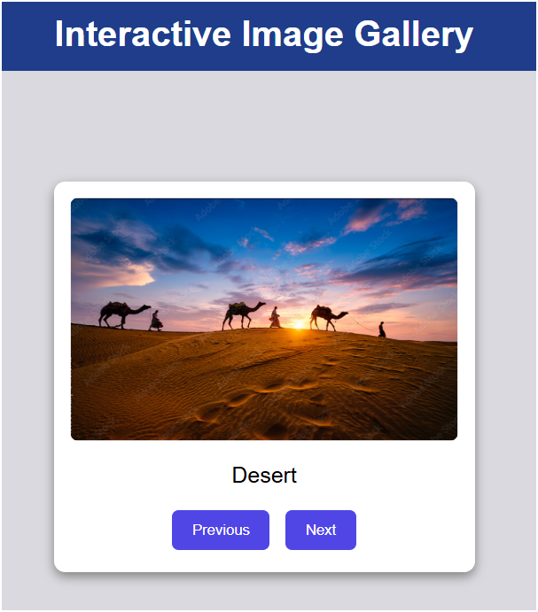

# Ex.07 Design of Interactive Image Gallery

## AIM
  To design a web application for an inteactive image gallery with minimum five images.

## DESIGN STEPS

## Step 1:

Clone the github repository and create Django admin interface

## Step 2:

Change settings.py file to allow request from all hosts.

## Step 3:

Use CSS for positioning and styling.

## Step 4:

Write JavaScript program for implementing interactivit

## Step 5:

Validate the HTML and CSS code

## Step 6:

Publish the website in the given URL.

## PROGRAM
```html


<!DOCTYPE html>
<html lang="en">
<head>
    <meta charset="UTF-8">
    <title>Interactive Image Gallery</title>

    <link rel="stylesheet" href="">
</head>
<body>

<h1>Interactive Image Gallery</h1>

<div class="gallery-container">
    

    <p id="imageTitle"></p>

    <div class="buttons">
        <button onclick="previousImage()">Previous</button>
        <button onclick="nextImage()">Next</button>
    </div>
</div>

<script src=""></script>

</body>
</html>
```
```css
body {
    margin: 0;
    background-color: #d9d9df;
    font-family: Arial, sans-serif;
    text-align: center;
}

h1 {
    background-color: #1f3d8a;
    color: white;
    padding: 15px;
    margin: 0;
}

.gallery-container {
    width: 350px;
    margin: 100px auto;
    background-color: white;
    padding: 15px;
    border-radius: 10px;
    box-shadow: 0px 4px 10px gray;
}

.gallery-container img {
    width: 100%;
    height: 220px;
    border-radius: 8px;
}

#imageTitle {
    font-size: 20px;
    margin: 15px 0;
}

button {
    background-color: #4f46e5;
    color: white;
    border: none;
    padding: 10px 18px;
    border-radius: 6px;
    cursor: pointer;
    margin: 5px;
}

button:hover {
    background-color: #3730a3;
}
```
```js
const images = [
{
url: "/static/gallery/image1.jpg",
title: "Mountain Landscape"
},
{
url: "/static/gallery/image2.jpg",
title: "Beach"
},
{
url: "/static/gallery/image3.jpg",
title: "Forest Path"
},
{
url: "/static/gallery/image4.png",
title: "Waterfall"
},
{
url: "/static/gallery/image5.png",
title: "Desert"
},
];

let currentIndex = 0;

const imageElement = document.getElementById("galleryImage");
const titleElement = document.getElementById("imageTitle");

function showImage() {
    imageElement.src = images[currentIndex].url;
    titleElement.textContent = images[currentIndex].title;
}

function nextImage() {
    currentIndex++;

    if (currentIndex >= images.length) {
        currentIndex = 0;
    }

    showImage();
}

function previousImage() {
    currentIndex--;

    if (currentIndex < 0) {
        currentIndex = images.length - 1;
    }

    showImage();
}

showImage();
```
## OUTPUT





## RESULT
  The program for designing an interactive image gallery using HTML, CSS and JavaScript is executed successfully.
